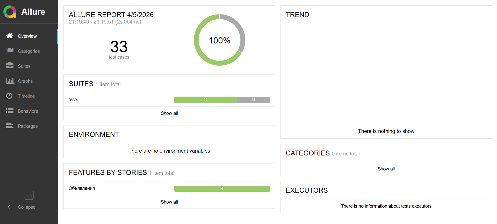

#### Инструкция по запуску

1. Склонируйте к себе репозиторий, выполнив команду в терминале:
    ```bash
    git clone https://github.com/evseenkovia/avito-internship-qa-evseenkovia.git
    ```
    Или скачайте zip архив и распакуйте его в удобную директорию.

2. Убедитесь, что на Вашем компьютере установлен Python (версия 3.11 или выше). В командной строке/терминале выполните команду:
    ```bash
    python --version
    ```  
    Если он не установлен, скачайте его с официального сайта python.org. 
    При установке на Windows обязательно отметьте чекбокс "Add python.exe to PATH", чтобы команды корректно распознавались системой.

3. Через командную строку/терминал перейдите в корневую директорию проекта:
   ```bash
   cd путь/до/директории/проекта
   ```
4. Настройте виртуальное окружение, выполнив команду:
    ```bash
    python -m venv .venv
    ```
    Активируйте его:
    Для Windows:
    ```bash
    .\.venv\Scripts\activate
    ```
    Для macOS/Linux:
    ```bash
    source .venv/bin/activate
    ```

5. Установите все необходимые зависимости из файла requirements.txt. Это обязательный шаг для корректной работы всех библиотек (pytest, allure-pytest, httpx):
    ```bash
    pip install -r requirements.txt
    ```
    Если команда не выполняется, попробуйте:
    ```bash
    pip3 install -r requirements.txt
    ```
6. Для выполнения автотестов выполните команду:
    ```bash
    pytest
    ```
    Чтобы выполнить тесты в конкретном файле, явно укажите в параметрах путь к файлу (по умолчанию все файлы находятся в папке tests):
    ```bash
    pytest tests/файл_с_тестами.py
    ```

7. Для генерации и просмотра отчетов убедитесь, что в Вашей системе установлен Allure Commandline.
    Для Windows (через Scoop):
    ```bash
    scoop install allure
    ```
    Для macOS (через Homebrew): 
    ```bash
    brew install allure
    ```
    Ручная установка: скачайте архив с GitHub allure-framework, распакуйте его и добавьте путь к папке bin в переменную окружения PATH.
8. Наконец, запустите тесты и сгенерируйте отчет. Для этого необходимо выполнить две команды последовательно:Шаг А: Запуск тестов и сбор результатов в папку allure-results:
    ```bash
    pytest --alluredir=allure-results
    ```
    Шаг Б: Генерация и автоматическое открытие готового отчета в браузере:
    ```bash
    allure serve allure-results
    ```
    Для просмотра документации в бразуере откроется аналогичное окно:
    

9. Завершить просмотр документации можно выполнив команду:
    ```bash
    Ctrl + C
    ```
    с параметром Y.